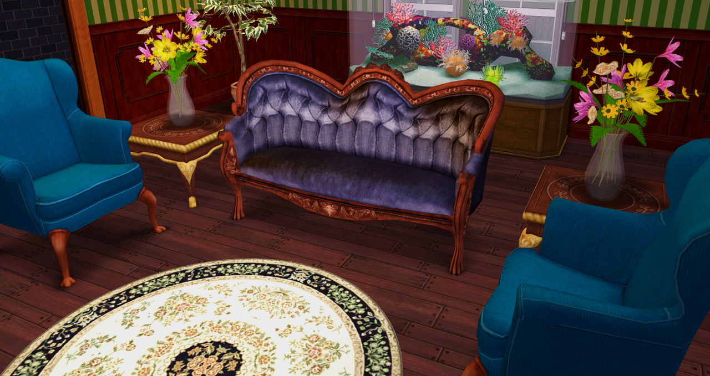
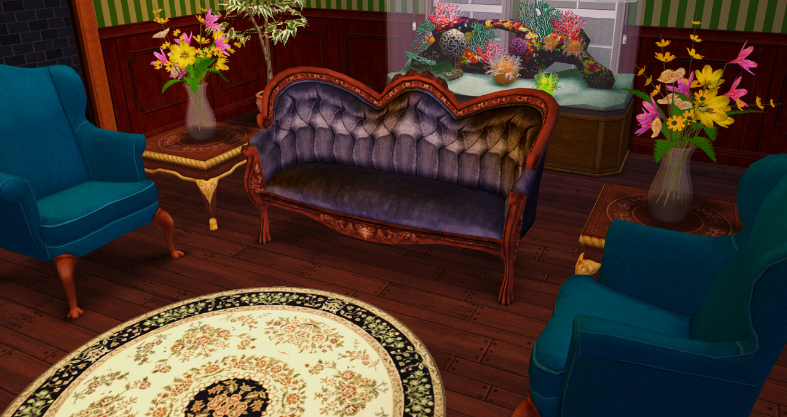
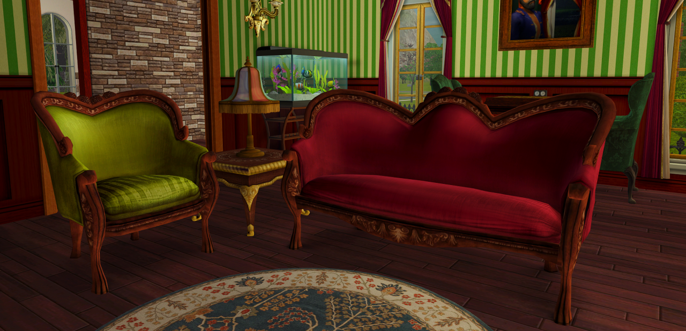
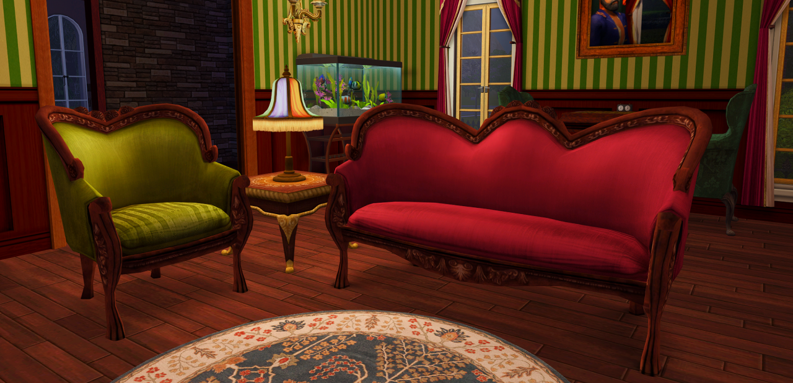
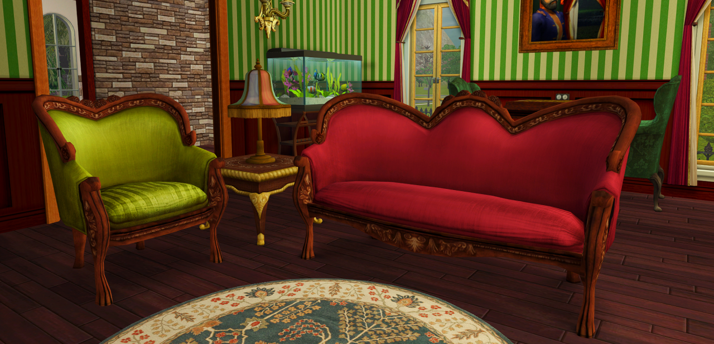
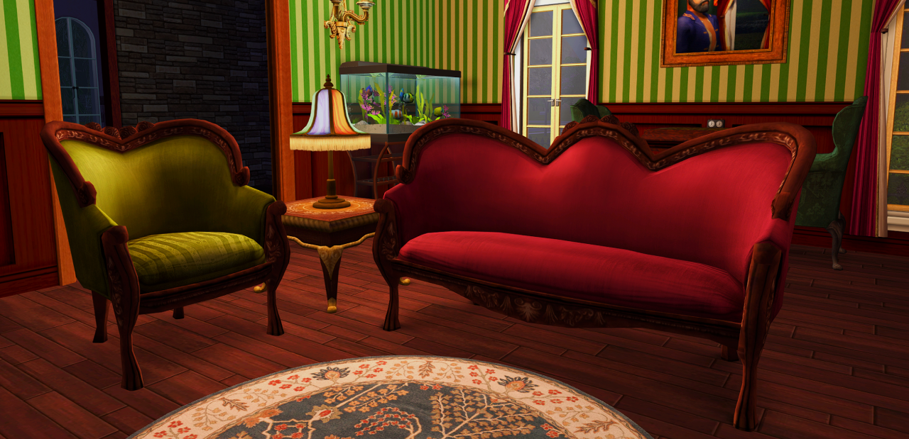
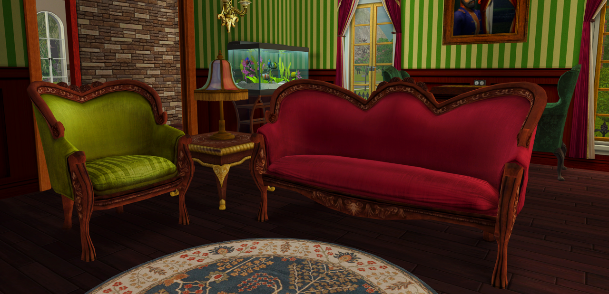
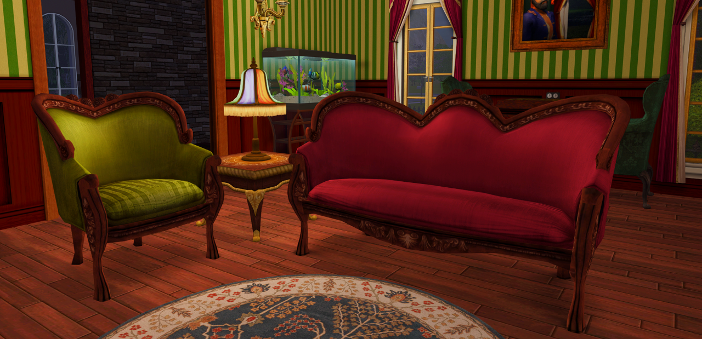

# **COZY HOME: A SIMS 2 LIGHTING MOD**


## TABLE OF CONTENTS
   * [**ABOUT**](#about)
   * [**FEATURES**](#features)
   * [**INDOOR LIGHTING CONFIGURATION**](#indoor-lighting-configuration)
   * [**TIME OF DAY & SEASONS CONFIGURATION**](#time-of-day--seasons-configuration)
   * [**LIGHTING DIRECTION**](#lighting-direction)
   * [**WORLD LIT BY FIRE**](#world-lit-by-fire)
   * [**GAME INSTALLATION FOLDERS**](#game-installation-folders)
      + [**Ultimate Collection**](#ultimate-collection)
      + [**Legacy Collection**](#legacy-collection)
      + [**Disc Version**](#disc-version)
   * [**LIGHTS FOLDER LOCATION**](#lights-folder-location)
   * [**DOWNLOAD INSTRUCTIONS**](#download-instructions)
   * [**INSTALLATION INSTRUCTIONS**](#installation-instructions)
   * [**SWITCHING LIGHTING DIRECTIONS**](#switching-lighting-directions)
   * [**UPDATING INSTRUCTIONS:**](#updating-instructions)
   * [**CHEAT CONFIGURATION**](#current-cheat-configuration)
   * [**UNINSTALLATION INSTRUCTIONS**](#uninstallation-instructions)
   * [**OPTIONAL STEPS:**](#optional-steps)
      + [**Disable Dusk/Dawn Lighting**](#disable-duskdawn-lighting)
      + [**Use Day CAS Lighting**](#use-day-cas-lighting)
      + [**Choose a Different Indoor Lighting Style:**](#choose-a-different-indoor-lighting-style)
   * [**RECOMMENDED MODS**](#recommended-mods)
   * [**CREDITS**](#credits)

## **ABOUT**

***Cozy Home*** is a lighting mod for the Sims 2 that was borne out of experimenting with different lighting mods and cherry-picking which features I liked in all of them, including sims 2 vanilla lighting. The result is a lighting mod built from the ground-up from vanilla Maxis files and slowly adding in things I liked from other lighting mods. 

As far as where this mod is in the maxis-match to realistic spectrum, this is somewhere in the Maxis-Mix ballpark like Cinema Secrets, but in a different way, a bit more maxis match-leaning.

## **FEATURES**

- Seasonal states from [Radiance 2.5](https://dreadpirate.tumblr.com/post/170494178792)
- Night lighting from [Cinema Secrets](https://veronavillequiltingbee.tumblr.com/cinemasecrets)
- [Dusk](https://kayleigh-83.tumblr.com/post/776206500239736832/a-maxis-match-lighting-mod-tweak), [Dawn](https://kayleigh-83.tumblr.com/post/776206500239736832/a-maxis-match-lighting-mod-tweak), and [Vacation](https://www.tumblr.com/kayleigh-83/776958316772458496/another-maxis-match-lighting-mod-tweak) lighting from @kayleigh83's Maxis Match Lighting Mod updates
- Lighting configurations build from pretty much the ground up
  - EAxian lighting fixes by Plasticbox and CircusWolf over at MTS.
  - Window portal settings are vanilla except for some configurations from Radiance/Cinema Secrets
  - Outdoor and Floor lighting are from [Maxis Match Lighting Mod](https://dreadpirate.tumblr.com/mmlightingmod)
  - New configurations for Wall and Table lighting based on Radiance and Cinema Secrets configuration
  - Neon lighting configurations ripped off from Radiance
  - Some configurations like of the lighting configuration workarounds for some lights like the canister ceiling light and the clam lights are ripped off from Radiance
- Uses a room object lighting algorithm not used in any other available lighting mod (but you can change this later)
- Compatibility with The Scriptorium.

### INDOOR LIGHTING CONFIGURATION
The lighting mod uses the `roomLightingType` value of 5. 
> NOTE: The Lighting Mod looks best with room lighting types 3 to 5. See the `Choose a Different Indoor Lighting Style` heading for instructions on how to change this

|                                                                           |                                                                               |
|---------------------------------------------------------------------------|-------------------------------------------------------------------------------|
| <br/>**Type 5 (default) - Day** | <br/>**Type 5 (default) - Night** |
| <br/>**Type 4 - Day**           | <br/>**Type 4 - Night**           |
| <br/>**Type 3 - Day**           | <br/>**Type 3 - Night**           |

### TIME OF DAY & SEASONS CONFIGURATION

> NOTE: Screenshots use the shaders from my "Recommended Mods" section below.

|                                                               |                                                               |
|---------------------------------------------------------------|---------------------------------------------------------------|
| <br/>**Spring**        | <br/>**Summer**        |
| <br/>**Autumn**        | <br/>**Winter**        |
| <br/>**Overcast**    | <br/>**Night**          |
| <br/>**Morning/Dawn** | <br/>**Evening/Dusk** |

### LIGHTING DIRECTION

There's an option for you to change the lighting direction of the lot depending on where you want the bright part of the lot to be. The sun orientation of a lot is semi-hardcoded at the lot level, so if you're aiming for sun accuracy, or you want a certain side of the lot to catch the sun, you can change the lighting direction. 

*Unlike Hook's original lighting direction files, however, my implementation of the lighting direction doesn't just affect the daytime lighting, but **morning, evening, and night lighting** as well.*

> NOTE: The lot in the preview photo's Sun orientation is facing at the front of the lot. If your lot's original sun orientation is not facing front, your results may vary.

|                                                         |                                                         |
|---------------------------------------------------------|---------------------------------------------------------|
| <br/>**Front** | <br/>**Right** |
| <br/>**Back**   | <br/>**Left**   |

### WORLD LIT BY FIRE

For those who play games where white lighting isn't desirable, you can switch to World Lit by Fire mode using one cheat code.

|                                                          |                                                                 |
|----------------------------------------------------------|-----------------------------------------------------------------|
| <br/>**Default** | <br/>**World Lit by Fire** |

### LIGHTING STYLES

Lighting Styles are sets of lighting definitions and configuration files for different effects depending on what kind of lighting you want. Each style has different lighting definitions, colour configurations, and time of day states.

You can choose from one of three:
- **Cozy** - this is a balanced lighting configuration between realistic and Maxis-styled lighting. Intensity of the lights is in between Cinematic and Smooth. If you don't otherwise change the default lighting setting this is the setting you will get.
- **Cinematic** - this is a more realistic, more saturated lighting configuration similar to the Radiance Lighting System and Cinema Secrets. Very dark nights and brighter lights
- **Smooth** - this is a smoother, softer, less saturated lighting configuration that is kind of like a souped-up Maxis Match Lighting mod. Perfect for more Maxis-Match players

Each style also has its own World Lit by Fire mode tailored to the lighting as well.

|                                                                                      |                                                                                          |
|--------------------------------------------------------------------------------------|------------------------------------------------------------------------------------------|
| <br/>**Cozy - Day**           | <br/>**Cozy - Night**           |
| <br/>**Cinematic - Day** | <br/>**Cinematic - Night** |
| <br/>**Smooth - Day**       | <br/>**Smooth - Night**       |

## **GAME INSTALLATION FOLDERS**

> The way the lighting mod is structured that unlike the vanilla lighting, where there's a `Lighting.txt` and `EPXLighting.nlo` files (sometimes, like in the case for Nightlife, multiple of them) for each EP is that for most of the EPs, every single NLO file is empty except for Base Game (which contains most of the lighting configuration), and the latest EP, which in this case is Mansion and Garden Stuff (where lighting direction controls reside)

### **Ultimate Collection**

- Base Game:
   - `Program Files (x86)\Origin Games\The Sims 2 Ultimate Collection\Double Deluxe\Base` (for the Origin version)
   - `MagiPacks\The Sims 2\Double Deluxe\Base` (for the MagiPack repack)
   - `Program Files (x86)\The Sims 2 Starter Pack\Double Deluxe\Base` (for Osab's repack)
- Mansion and Garden:
    - `Program Files (x86)\Origin Games\The Sims 2 Ultimate Collection\Fun with Pets\SP9`
    - `MagiPacks\The Sims 2\Fun with Pets\SP9` (for the MagiPack repack)
    - `Program Files (x86)\The Sims 2 Starter Pack\Fun with Pets\SP9` (for Osab's repack)

### **Legacy Collection**

- Base Game:
   - `Program Files (x86)\Steam\steamapps\common\The Sims 2 Legacy Collection\Base` (for the Steam version)
   - `Program Files\EA Games\The Sims 2 Legacy Collection\Base` (for the EA App version)
- Mansion and Garden:
   - `Program Files (x86)\Steam\steamapps\common\The Sims 2 Legacy Collection\EP9` (for the Steam version)
   - `Program Files\EA Games\The Sims 2 Legacy Collection\EP9` (for the EA App version)

### **Disc Version**

- Base Game:
   - `Program Files (x86)\EA GAMES\The Sims 2` (for regular Sims 2)
   - `Program Files (x86)\EA GAMES\The Sims 2 Deluxe\Base` (for Sims 2 Deluxe)
   - `Program Files (x86)\EA GAMES\The Sims 2 Double Deluxe\Base` (for Sims 2 Double Deluxe)
- Mansion and Garden:
   - `Program Files (x86)\EA GAMES\The Sims 2 Mansion and Garden Stuff` (for all version)

## **LIGHTS FOLDER LOCATION**

The Lights folder is located under `TSData\Res\Lights` under each Game Installation Folder.

## **DOWNLOAD INSTRUCTIONS**

Download and unzip the latest release from the [Releases](https://github.com/thedreadpirates/ts2-lightingmod-cozyhome/releases) page.

## **INSTALLATION INSTRUCTIONS**

****

These steps assume that you have already extracted the files to an accessible location and (if desired) have installed The Scriptorium with the Maxis lights option.

1. If you plan on installing the Scriptorium, install that first (with the Maxis lights option) because the Scriptorium installer will overwrite your lighting files. If you use any custom lighting mods, delete the contents of your BASE GAME Lights folder AND your Mansion and Garden Lights folder in your Game Installation folders first.

2. If you are an Ultimate Collection user, copy ALL THE CONTENTS of folder 1.0 to your game installation folder (usually found in Origin Games\The Sims 2 Ultimate Collection) and skip to STEP 5. This applies whether the game was obtained officially or unofficially (IYKYK).

3. If you installed TS2 from disk (aka if you have THe Sims 2 Mansion and Garden Stuff folder), click on the folder labeled 2.0, then copy the contents to your game installation folder (usually found in Program Files [or Program Files (x86)]\EA Games)

    - IF the Base Game, Nightlife, and Celebrations! Stuff are in separate folders, copy the CONTENTS of the folder labeled 2.1 to your game installation folder
    - ELSE IF you have a folder named “The Sims 2 Deluxe”, copy the CONTENTS of the folder labeled 2.2
    - ELSE IF you have a folder named “The Sims 2 Double Deluxe”, copy the CONTENTS of the folder labeled 2.3

4. If you have the Legacy Collection, copy the contents of the folder labeled 3.0 to your game installation folder. After this, immediately jump to STEP 5.

5. Copy the lines inside the `userStartup.cheat` file provided to your `userStartup.cheat` if you have the file, otherwise copy the userStartup.cheat provided to your `Documents\EA Games\The Sims 2\Config` folder, if you don’t.

6. Copy the contents of the folder labeled 4.0 to your Downloads folder. These contain the fixed Store lights as well as the required night light map replacements for both lot and neighborhood lighting.

## **SWITCHING LIGHTING STYLES**

To switch lighting directions (Back, Left, Right), type the following cheats:

| **Lighting Style**    | **Front (default)**                   | **Back**           | **Left**           | **Right**           |
|-----------------------|---------------------------------------|--------------------|--------------------|---------------------|
| Default               | `ltClear` or `ltFront`                | `ltBack`           | `ltLeft`           | `ltRight`           |
| Default (Fire Mode)   | `ltFire` or `ltFireFront`             | `ltFireBack`       | `ltFireLeft`       | `ltFireRight`       |
| Cozy                  | `ltCozy` or `ltCozyFront`             | `ltCozyBack`       | `ltCozyLeft`       | `ltCozyRight`       |
| Cozy  (Fire Mode)     | `ltCozyFire` or `ltCozyFireFront`     | `ltCozyFireBack`   | `ltCozyFireLeft`   | `ltCozyFireRight`   |
| Cinematic             | `ltCinema` or `ltCinemaFront`         | `ltCinemaBack`     | `ltCinemaLeft`     | `ltCinemaRight`     |
| Cinematic (Fire Mode) | `ltCinemaFire` or `ltCinemaFireFront` | `ltCinemaFireBack` | `ltCinemaFireLeft` | `ltCinemaFireRight` |
| Smooth                | `ltSmooth` or `ltSmoothFront`         | `ltSmoothBack`     | `ltSmoothLeft`     | `ltSmoothRight`     |
| Smooth (Fire Mode)    | `ltSmoothFire` or `ltSmoothFireFront` | `ltSmoothFireBack` | `ltSmoothFireLeft` | `ltSmoothFireRight` |

## **SWITCHING DEFAULT LIGHTING STYLE**

The mod uses the _**Cozy**_ lighting style by default, but you can switch to any of the other lighting mods by following these steps:

1. Go to your Mansion and Garden Lights folder.
2. Copy the original `Lighting.txt` file and rename to `Lighting_bak.txt`
3. Open `Lighting.txt` file and look for the first `sinclude` line and change it to the file of the lighting style you want. 
4. Save.
5. Repeat Steps 2-4 with `Lighting_Back.txt`, `Lighting_Left.txt`, and `Lighting_Right.txt`, changing the first `sinclude` line with the corresponding light direction file for each lighting mod.
6. If your game is open, key in CTRL+SHIFT+C, then type `sld`

### Lighting File Table

| **Lighting Style**    | **Front (default)**           | **Back**                           | **Left**                           | **Right**                           |
|-----------------------|-------------------------------|------------------------------------|------------------------------------|-------------------------------------|
| Cozy                  | `Lighting_Cozy.txt`           | `Lighting_Cozy_Back.txt`           | `Lighting_Cozy_Left.txt`           | `Lighting_Cozy_Right.txt`           |
| Cozy  (Fire Mode)     | `Lighting_Cozy_WLBF.txt`      | `Lighting_Cozy_WLBF_Back.txt`      | `Lighting_Cozy_WLBF_Left.txt`      | `Lighting_Cozy_WLBF_Right.txt`      |
| Cinematic             | `Lighting_Cinematic.txt`      | `Lighting_Cinematic_Back.txt`      | `Lighting_Cinematic_Left.txt`      | `Lighting_Cinematic_Right.txt`      |
| Cinematic (Fire Mode) | `Lighting_Cinematic_WLBF.txt` | `Lighting_Cinematic_WLBF_Back.txt` | `Lighting_Cinematic_WLBF_Left.txt` | `Lighting_Cinematic_WLBF_Right.txt` |
| Smooth                | `Lighting_Smooth.txt`         | `Lighting_Smooth_Back.txt`         | `Lighting_Smooth_Left.txt`         | `Lighting_Smooth_Right.txt`         |
| Smooth (Fire Mode)    | `Lighting_Smooth_WLBF.txt`    | `Lighting_Smooth_WLBF_Back.txt`    | `Lighting_Smooth_WLBF_Left.txt`    | `Lighting_Smooth_WLBF_Right.txt`    |


## **UPDATING INSTRUCTIONS:**

1. To update the lighting mod, delete all files (EXCEPT Scriptorium-related files, if you have them) in your BASE GAME and MANSION & GARDEN Lights folders, then place the updated files inside.
2. If there are any cheat updates, delete all lines related to lighting from your userStartup.cheat file and replace with the lines in the updated userStartup.cheat.

## Current Cheat Configuration

```
#### LIGHTING CHEATS ####
ignoreErrors true
boolProp UseShaders true
boolProp specHighlights true
boolProp floorAndWallNormalMapping true
boolProp bumpMapping true
boolProp skipTangentsInVertexData false      #false for bumpmapping!
uintProp optionLightingQuality 3             #These two lines set the lighting option and
uintProp LightingQuality 3                   #the lighting level to MAX (as required)
boolProp gpuCompositing true
floatProp geomBoneInfluenceThreshold 0.01
floatProp geomPerBoneBoundBlendWeightThreshold 0.9
boolProp geomCheckGeomDataIntegrity false
boolProp geomGenerateTangentSpaceSxT true
##########################

#### LIGHTING ALIASES ####
alias ltClear "setlotlightingfile clear" "default lighting style - front" "default lighting style - front"
alias ltFront "setlotlightingfile Lighting.txt" "default lighting style - front" "default lighting style - front"
alias ltBack "setlotlightingfile Lighting_Back.txt" "default lighting style - back" "default lighting style - back"
alias ltLeft "setlotlightingfile Lighting_Left.txt" "default lighting style - left" "default lighting style - left"
alias ltRight "setlotlightingfile Lighting_Right.txt" "default lighting style - right" "default lighting style - right"

alias ltFire "setlotlightingfile Lighting_WLBF.txt" "default lighting style - front" "default lighting style - front"
alias ltFireFront "setlotlightingfile Lighting_WLBF.txt" "default lighting style (fire) - front" "default lighting style (fire) - front"
alias ltFireBack "setlotlightingfile Lighting_WLBF_Back.txt" "default lighting style (fire) - back" "default lighting style (fire) - back"
alias ltFireLeft "setlotlightingfile Lighting_WLBF_Left.txt"  "default lighting style (fire) - left" "default lighting style (fire) - left"
alias ltFireRight "setlotlightingfile Lighting_WLBF_Right.txt"  "default lighting style (fire) - right" "default lighting style (fire) - right"

alias ltCozy "setlotlightingfile Lighting_Cozy.txt" "cozy lighting style - front" "cozy lighting style - front"
alias ltCozyFront "setlotlightingfile Lighting_Cozy.txt" "cozy lighting style - front" "cozy lighting style - front"
alias ltCozyBack "setlotlightingfile Lighting_Cozy_Back.txt" "cozy lighting style - back" "cozy lighting style - back"
alias ltCozyLeft "setlotlightingfile Lighting_Cozy_Left.txt" "cozy lighting style - left" "cozy lighting style - left"
alias ltCozyRight "setlotlightingfile Lighting_Cozy_Right.txt" "cozy lighting style - right" "cozy lighting style - right"

alias ltCozyFire "setlotlightingfile Lighting_Cozy_WLBF.txt" "cozy lighting style (fire) - front" "cozy lighting style (fire) - front"
alias ltCozyFireFront "setlotlightingfile Lighting_Cozy_WLBF.txt" "cozy lighting style (fire) - front" "cozy lighting style (fire) - front"
alias ltCozyFireBack "setlotlightingfile Lighting_Cozy_WLBF_Back.txt" "cozy lighting style (fire) - back" "cozy lighting style (fire) - back"
alias ltCozyFireLeft "setlotlightingfile Lighting_Cozy_WLBF_Left.txt" "cozy lighting style (fire) - left" "cozy lighting style (fire) - left"
alias ltCozyFireRight "setlotlightingfile Lighting_Cozy_WLBF_Right.txt" "cozy lighting style (fire) - right" "cozy lighting style (fire) - right"

alias ltCinema "setlotlightingfile Lighting_Cinematic.txt" "cinematic lighting style - front" "cinematic lighting style - front"
alias ltCinemaFront "setlotlightingfile Lighting_Cinematic.txt" "cinematic lighting style - front" "cinematic lighting style - front"
alias ltCinemaBack "setlotlightingfile Lighting_Cinematic_Back.txt" "cinematic lighting style - back" "cinematic lighting style - back"
alias ltCinemaLeft "setlotlightingfile Lighting_Cinematic_Left.txt" "cinematic lighting style - left" "cinematic lighting style - left"
alias ltCinemaRight "setlotlightingfile Lighting_Cinematic_Right.txt" "cinematic lighting style - right" "cinematic lighting style - right"

alias ltCinemaFire "setlotlightingfile Lighting_Cinematic_WLBF.txt" "cinematic lighting style (fire) - front" "cinematic lighting style (fire) - front"
alias ltCinemaFireFront "setlotlightingfile Lighting_Cinematic_WLBF.txt" "cinematic lighting style (fire) - front" "cinematic lighting style (fire) - front"
alias ltCinemaFireBack "setlotlightingfile Lighting_Cinematic_WLBF_Back.txt" "cinematic lighting style (fire) - back" "cinematic lighting style (fire) - back"
alias ltCinemaFireLeft "setlotlightingfile Lighting_Cinematic_WLBF_Left.txt" "cinematic lighting style (fire) - left" "cinematic lighting style (fire) - left"
alias ltCinemaFireRight "setlotlightingfile Lighting_Cinematic_WLBF_Right.txt" "cinematic lighting style (fire) - right" "cinematic lighting style (fire) - right"

alias ltSmooth "setlotlightingfile Lighting_Smooth.txt" "smooth lighting style - front" "smooth lighting style - front"
alias ltSmoothFront "setlotlightingfile Lighting_Smooth.txt" "smooth lighting style - front" "smooth lighting style - front"
alias ltSmoothBack "setlotlightingfile Lighting_Smooth_Back.txt" "smooth lighting style - back" "smooth lighting style - back"
alias ltSmoothLeft "setlotlightingfile Lighting_Smooth_Left.txt" "smooth lighting style - left" "smooth lighting style - left"
alias ltSmoothRight "setlotlightingfile Lighting_Smooth_Right.txt" "smooth lighting style - right" "smooth lighting style - right"

alias ltSmoothFire "setlotlightingfile Lighting_Smooth_WLBF.txt" "smooth lighting style - front" "smooth lighting style - front"
alias ltSmoothFireFront "setlotlightingfile Lighting_Smooth_WLBF.txt" "smooth lighting style - front" "smooth lighting style - front"
alias ltSmoothFireBack "setlotlightingfile Lighting_Smooth_WLBF_Back.txt" "smooth lighting style - back" "smooth lighting style - back"
alias ltSmoothFireLeft "setlotlightingfile Lighting_Smooth_WLBF_Left.txt" "smooth lighting style - left" "smooth lighting style - left"
alias ltSmoothFireRight "setlotlightingfile Lighting_Smooth_WLBF_Right.txt" "smooth lighting style - right" "smooth lighting style - right"
##########################
```

## **UNINSTALLATION INSTRUCTIONS**

1. Delete the contents of the LIGHTS folder for both BASE GAME and MANSION and GARDEN.
2. Copy the contents of the [Lights Backup](http://www.mediafire.com/file/elcrtdl6kx0x0sq/Lights_Backup.7z/file) file according to your game setup (UC, Legacy, or Disk).

## **OPTIONAL STEPS:**

### **Disable Dusk/Dawn Lighting**

1. Go to your BASE GAME Lighting.txt and look for the following line:
```
setb morningEvening true
```
2. Change `true` to `false`.
3. Save changes.

### **Use Day CAS Lighting**

For those who use a CAS replacement with custom lighting setup, you might want to turn off the CAS lights:

1. Go to the BASE GAME Lights Folder.
2. Go to the `CAS_lighting.txt`
3. Change the following lines from 0 to 1.
```
seti FamilyAreaOff 0
seti PodiumAreaOff 0
```
4. Save.

### **Choose a Different Indoor Lighting Style:**
1. Go to your BASE GAME Lighting.txt and look for the following line:
```
setf roomLightingType 5
```
2. You may choose any number between 0 and 7, but I personally recommend anything between 3 and 5 depending on your personal preference.
3. Save.

## **RECOMMENDED MODS**

First two I highly recommend. The others are nice to have.

- [Improved Lot Skirt Shader](https://www.tumblr.com/christaskyy/819029196325191680/ts2-improved-lot-skirt-shader-wip): makes lot skirts in TS2 looking like neighborhood terrain
- [Improved Water Mod](https://www.tumblr.com/spockthewok/818878027669864448/ts2-water-mod-update?source=share): Fixes mirror reflections and improves on the neighborhood water reflections
- [Accurate Neighborhood Terrain Lighting](https://modthesims.info/d/654677/accurate-neighborhood-terrain-lighting.html): Matches neighborhood lighting with lot lighting. Use the versions suffixed with “-lightingremedy”
- All of PineappleForest's [light fixes](https://pforestsims.tumblr.com/tagged/ts2%20object%20fixes): The lighting changes were made with these fixes in mind.
- [Blue Snow Fix](https://dreadpirate.tumblr.com/post/179182314487/blue-snow-no-more-shader-fixes-ive-included): Winter snow at night is blue. Very blue. This fixes it. If you want to use some water mods or roof shader mods, options are also available. I use EA roofs and Voeille's lot and neighborhood water
- [StandardMaterial Shader](https://crispsandkerosene.tumblr.com/post/758562617469091841/extended-standardmaterial-shader-for-the-sims-2). Improves on the shaders that render objects. If you want to use this mod, use this shader instead of the “main” shaders in the snow fixes.
- [Extended SimStandardMaterial Shader](https://crispsandkerosene.tumblr.com/post/768598233529434112/extended-simstandardmaterial-shader-for-the-sims-2): Has several fixes that enable shiny textures on clothing, etc. I personally use the brighter sims version, but either is great.

## **CREDITS**
- @spookymuffinsims, for your lighting mod that served as a base for the maxis match lighting mod that started this all
- @nightracer for the base of the Seasonal Lighting Tweaks
- @criquette-was-here, for the different shader and hood lighting tweaks
- @bugjartimedecayoff for the base for night, dusk and dawn lighting
- @kayleigh83 for the dusk, dawn, and vacation lighting fixes
- @simnopke for the SkyFix, and the valuable feedback
- Gunmod, ChocolatePi, Ddefinder for the hard work on the Radiance Lighting System
- Plasticbox and CircusWolf for the object lighting fixes used in Vanilla Plus and Maxis Match Lighting Mod
- Almighty Hat for the World Lit By Fire tweak for Radiance, which I adapted for this mod
- @teaaddictyt and others in the Tea Addict Discord server for the valuable testing and feedback
- HugeLunatic for the much better M&G chandelier fix
- Hook, for the lighting direction changes
- @justmiha97 for some pointers on the portal lighting for dusk and dawn and some ideas for the room lighting
- @christaskyy for the Lot Skirt shader, which allowed me to finally match the lighting in lot skirt and boundaries
